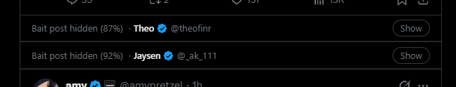

# Tolerable X Feed

**Are you tired of pretentious engagement-bait posts on X?**

> *"You wake up in 1999 with a laptop and a coding agent. What do you ship first?"*
> *"Name one engineer who writes better code than an LLM."*
> *"Major release is live today 🚀 $0.11 per 1M tokens, try it now →"*

Same here. Tolerable X Feed is a Tampermonkey userscript that reads your timeline and folds away the posts that exist only to farm replies or sell you something:

| Filter | Catches | How |
| --- | --- | --- |
| **Bait** | "Name one…", "You wake up in 1999…", "Be honest:…", would-you-rather and hot-take polls | AI ([Jev](https://docs.typesafe.ai)) |
| **Promo** | Product launches, pricing drops, discount codes, webinars, Product Hunt begging, "try it now" links | AI ([Jev](https://docs.typesafe.ai)) |
| **Ad** | Paid posts X labels as "Ad" | Read from the page, free |

Changed your mind? Click **Show** to open a post. It gets a light amber tint so you know it was flagged, and **Hide** folds it back.

## Features

- **Classifies by meaning, not keywords.** Jev, TypeSafe's System One decision model, scores every post from 0 to 1 for each filter. Real questions, news, research, releases you'd want to know about, and jokes stay in your feed.
- **Bring your own backend.** Use OpenRouter, TypeSafe's own API, or any self-hosted server that speaks the System One API.
- **Shows who posted it.** The collapsed bar shows the author's name, @handle, and a blue or gold verified badge.
- **Settings panel.** Turn each filter on or off, set its own threshold, choose collapse or remove, test your connection, and see how much you've spent.
- **Leaves you alone.** Your own posts are never classified or hidden.
- **Cheap.** Under **1¢ per 1,000 posts** on hosted Jev (see [Efficiency](#efficiency)). Every score is cached, and paid ads never reach the AI.

## Install

1. Install [Tampermonkey](https://www.tampermonkey.net/) (or Violentmonkey).
2. Open **[tolerable-x-feed.user.js](https://raw.githubusercontent.com/nikkoxgonzales/tolerable-x-feed/main/tolerable-x-feed.user.js)**. Tampermonkey will offer to install it.
3. Pick a provider (below) and get a key.
4. Open [x.com](https://x.com). The settings panel opens on first run. Choose your provider, paste the key, and click **Test connection**.

Updates are picked up automatically through Tampermonkey's update check.

## Providers

All three use the same System One request (`POST { model, state, questions }`), so filters behave the same everywhere.

| Provider | Default endpoint | Default model | Key |
| --- | --- | --- | --- |
| **OpenRouter** (default) | `https://openrouter.ai/api/alpha/decisions` | `~typesafe/jev-latest` (always the newest Jev) | [openrouter.ai/settings/keys](https://openrouter.ai/settings/keys) |
| **TypeSafe** | `https://api.typesafe.ai/v1/systemone` | `jev-latest` | [typesafe.ai](https://typesafe.ai) |
| **Custom / self-hosted** | anything, e.g. `http://192.168.1.10:8224/v1/systemone` | `jev-1.13` | optional Bearer token |

- Every provider keeps its own URL, model, and key, so switching between them doesn't lose anything. Leave URL or model blank to use the default.
- **Custom** also takes **extra headers** as JSON (e.g. `{"X-Api-Key": "…"}`) for servers behind a proxy or gateway.
- The first time the script calls a custom host, Tampermonkey asks you to allow the connection. Choose **Always allow**.
- OpenRouter's System One endpoint (`https://openrouter.ai/api/v1/systemone`, model `jev-1.13`) also works as a custom endpoint.

## Settings

Open **Tampermonkey menu → Settings** on x.com:

- **Filters.** Toggle Ad, Bait, and Promo separately. Each AI filter has a threshold slider (default 60%): a post is hidden when its score is at or above it, so lower means stricter.
- **Display.** *Collapse* keeps a slim bar with Show/Hide; *Remove completely* takes the post out of the feed.
- **Score badges.** Shows `bait 0.12 · promo 0.03` on every post, which helps when picking thresholds.
- **AI provider.** Provider, endpoint, model, key, and extra headers, plus **Test connection** and **Clear cache**.

**Tampermonkey menu → Pause / resume** switches everything off without uninstalling.

## How it works

1. A `MutationObserver` watches the timeline for posts (`article[data-testid="tweet"]`).
2. Posts carrying X's "Ad" label are collapsed right away.
3. Every other post is queued and sent in batches of up to 16 to your System One endpoint. Each post carries its text, the author's display name, and whether the account is unverified, verified, or a verified organization (gold check).
4. The request's `state` holds a definition of each filter once (bait comes with a few sample posts). Each post gets one short yes/no (`noul`) question per filter: ``Is `post_3` `definitions.engagement_bait`?``
5. Jev returns a probability per post per filter. Results are cached, and anything at or above a filter's threshold is collapsed.

## Efficiency

Jev bills input tokens only, counting the state and every question. Questions run in parallel, so packing many into one request is fast. The catch is repetition: if every question restates the full definition, the question text costs more than the posts. We benchmarked four layouts on the same 82 labeled posts (62 bait from [`twitter-bait-questions.txt`](twitter-bait-questions.txt), 10 promo, 10 ordinary) at the default 60% threshold:

| Layout | Tokens / post | $ / 1k posts | Bait caught | Promo caught | False flags |
| --- | --- | --- | --- | --- | --- |
| Full definition in every question, 8 posts/request (v2.0) | 436 | $0.018 | 62/62 | 10/10 | 1 |
| Definitions once in state, 8 posts/request | 184 | $0.008 | 62/62 | 10/10 | 0 |
| **Definitions once in state, 16 posts/request (current)** | **144** | **$0.006** | **62/62** | **10/10** | **0** |
| Full definition, 1 post/request | 798 | $0.034 | 61/62 | 10/10 | 1 |

The current layout is about **3x cheaper** than v2.0 with no accuracy loss. Bigger batches cost less per post, but each extra post is more unrelated text in the state, which can hurt Jev's accuracy, so the batch size is capped at 16. The promo filter correctly left alone news from organization accounts (Reuters, NASA).

## Privacy

- Post text, author display name, and verification type are sent to the provider you choose. Nothing else is: no @handles, account info, or browsing data.
- Your keys stay in your browser's Tampermonkey storage and are only sent to the endpoint they belong to.

## Tuning

- Turn on **score badges**, see where your timeline sits, and adjust the thresholds.
- Edit a filter's `definition` (or `BAIT_EXAMPLES`) near the top of the script to fit what you see. Adding a new AI filter means adding one more entry to `FILTERS`: a label, a term, and a definition.

If X changes its markup and the script stops finding posts or ads, please [open an issue](https://github.com/nikkoxgonzales/tolerable-x-feed/issues).

## License

MIT
